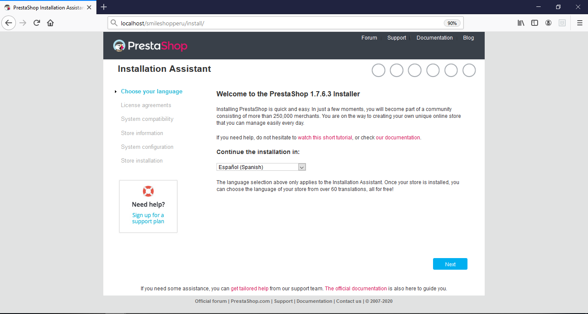
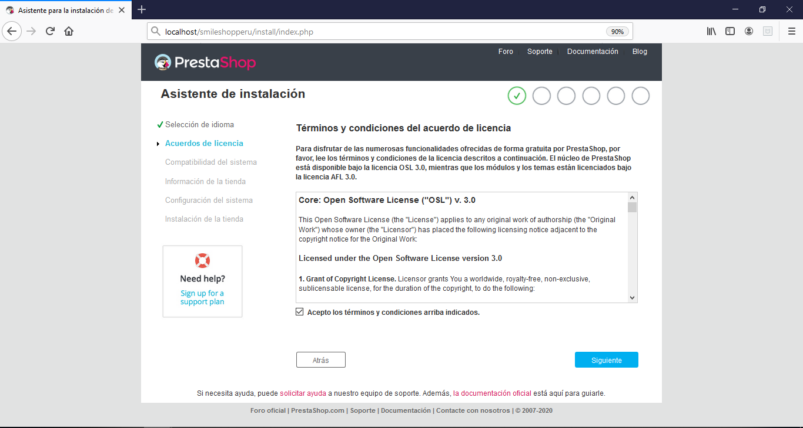
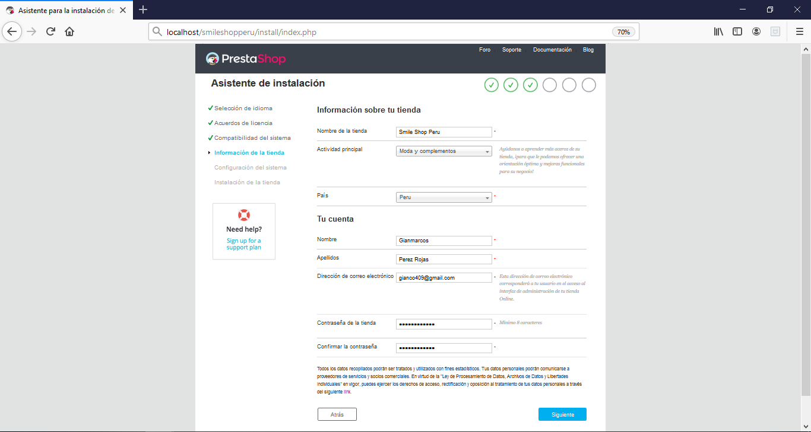
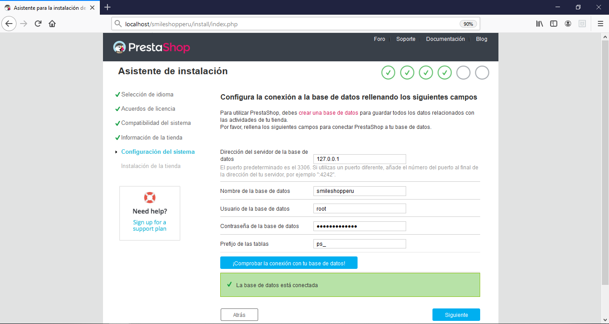
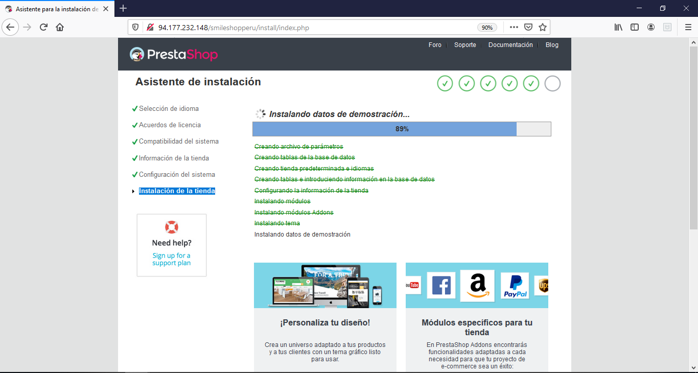
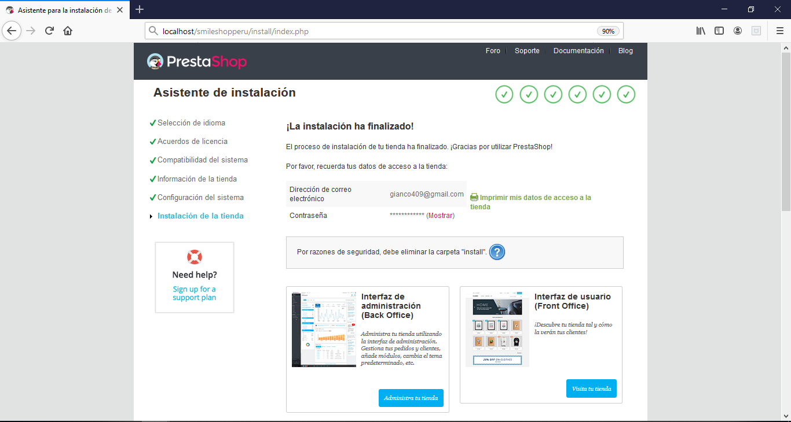

# SMILE SHOP PERU

Es una tienda virtual de comercio electrónico de ropa y accesorios de moda.

## Tecnologia:
- [Prestashop](https://www.prestashop.com/es) : CMS graturito de codigo abierto, pensado para construir desde cero una tienda en linea de comercio electronico.

## Instalacion:
- Descargar el proyecto del reposirotio usando el comando:
```
git clone https://github.com/gianco409/smileshopperu.git
```
- Ubicar la carpeta del proyecto en el servidor: Xamp, Wamp o Apache
- Abrir el navegador y entrar a la siguiente ruta:
```
https://localhost/smileshopperu
```
- Esperar un momento y aparecera una pagina para iniciar la instalación y configuración

- Seleccionamos el idioma.
<h1 align = "center">
  
</h1>

- Aceptamos los acuerdos de licencia.
<h1 align = "center">
  
</h1>

- Luego nos muestra alertas si falta instalar alguna libreria de PHP.

- Ingresamos los datos de la empresa.
<h1 align = "center">
  
</h1>

- Agregamos las credenciales para el acceso a la base de datos.
<h1 align = "center">
  
</h1>

- Automaticamente se crearan las tablas para la base de datos y se agregaran los modulos necesarios para el sistema.
<h1 align = "center">
  
</h1>

<h1 align = "center">
  
</h1>

- Ahora podemos ver nuestra tienda.
<h1 align = "center">
  
</h1>
- Y tambien una pagina para administrar el contenido, pero antes debemos eliminar la carpeta /intall dentro de la carpeta /smileshopperu y luego ingresar con nuestros datos de accesos ingresados anteriormente.
<h1 align = "center">
  
</h1>
